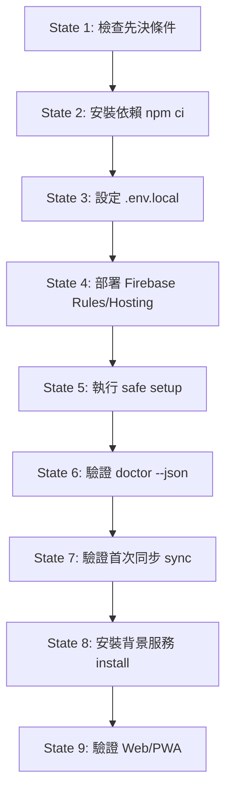

# 確定性 AI 安裝合約 (Deterministic AI Installation Contract)

本文件定義 **94AiUsageDashboard (Self-hosted)** 的確定性安裝合約。供人類開發者與 AI 程式碼助理（AI coding assistants）依照明確狀態機執行安裝、驗證與故障排除，杜絕未明先決條件與任何越權行為。

---

## 1. 架構邊界與支援模型

- **支援架構**：本專案的資料收集路徑必須依賴 **使用者的 Mac + OpenUsage 收集器 (Mac Companion)**。
- **不支援手機獨立收集**：不支援 phone-only standalone 額度收集。手機端 PWA / Web 僅作純檢視介面，讀取同步至使用者自己 Firebase 的正規化快照；手機端不會也不可能獨立讀取 Mac 本機 Provider 憑證或額度。
- **資料流**：
  ```text
  AI Tools (Codex / Antigravity / Claude Code)
          ↓ (本機已登入狀態)
      OpenUsage (CLI / 127.0.0.1 HTTP fallback)
          ↓ (本機正規化)
    Local Agent / Mac Companion (macOS)
          ↓ (以使用者 Google 帳號寫入)
    使用者自管 Firestore (Security Rules 強制隔離)
          ↓ (Firebase Auth 唯讀存取)
     Web / PWA (行動裝置或桌面瀏覽器)
  ```

---

## 2. AI 安全操作守則與禁止事項 (AI Safety Instructions)

AI 助理執行本安裝合約時，**必須無條件遵守**以下安全邊界：

### 2.1 機密與憑證邊界（Forbidden Secret Handling）
1. **嚴禁窺探、整檔覆蓋或輸出 `.env.local`**：
   - `cp .env.example .env.local` **僅在 `.env.local` 不存在時才可執行**。
   - 若 `.env.local` 已存在，AI **嚴禁整檔覆蓋（replace wholesale）、dump、讀取、列印或輸出檔案內容**。
   - AI 必須向使用者詢問確切的 Firebase Web 公開設定鍵值（named keys: `projectId`, `apiKey`, `authDomain`, `appId` 等），並透過**安全編輯機制**（safe edit mechanism）僅更新指定之 named keys，**不輸出亦不列印舊值**（without printing old values）。
   - 若手邊的可用工具無法在不讀取無關內容的情況下進行範圍限定（key-scoped）的安全編輯，**必須立即停止並請使用者手動編輯**這些鍵值（stop and ask user to edit manually）。
   - **嚴禁推薦或執行 `cat .env.local`**（never recommend `cat .env.local`）。
2. **嚴禁存取或輸出 macOS Keychain**：Firebase 長期 refresh credential 由 Mac Companion 自動安全寫入 Keychain，AI 嚴禁讀取、列印、導出或 dump Keychain 內容（never dump Keychain）。
3. **嚴禁讀取 Provider 登入檔案**：嚴禁存取、列印、上傳 Codex、Antigravity、Claude Code 的授權／session 檔或本機原始憑證。
4. **公開 Client Config vs 敏感憑證**：
   - Firebase Web API key 是**公開 client** 設定（public client configuration），不是 Admin 秘密。
   - 本專案**不需要 service-account**（never require service-account JSON or Admin SDK credentials），AI 嚴禁索取或建立 service-account JSON。
5. **嚴禁讀取 raw browser cookies**：不得讀取或上傳瀏覽器原始 cookie 或 session tokens。
6. **嚴禁變更 Provider 登入狀態**：不得 mutate 或更動任何 Provider 的登入 session。

### 2.2 營運、計費與儲存庫邊界
1. **嚴禁啟用計費（No Billing Enablement）**：不得替使用者啟用任何 Google Cloud / Firebase 計費（billing），亦不得引導升級至付費 Blaze 方案。
2. **嚴禁公開儲存庫（No Repo Publication）**：嚴禁在未經專案擁有者明確許可下變更 repo visibility 或將 repo 設為 public。
3. **嚴禁挑選授權條款（No License Selection）**：不得擅自替儲存庫新增或挑選開源授權條款（license）。
4. **嚴禁消耗 Reset Credit（No Reset Credit Consumption）**：安裝與測試流程嚴格維持只讀合約，不得在安裝過程消耗或觸發任何 rate-limit Reset Credit。

---

## 3. 先決條件 (Prerequisites)

執行安裝前，目標環境必須滿足：

1. **作業系統**：macOS 15 (Sequoia) 或更新版本（執行 Mac Companion）。
2. **執行環境**：Node.js 22 LTS (`>=22 <23`)。
3. **Google 帳號**：供使用者登入 Firebase 與同步資料。
4. **AI 工具登入**：Codex、Antigravity 或 Claude Code 至少有一項已在本機登入並正常運作。
5. **官方 OpenUsage**：
   - 已安裝官方 OpenUsage（例如透過 `brew install --cask openusage`）。
   - Mac Companion 優先使用 OpenUsage CLI；若 CLI 暫時不可用，會 fallback 到只限 `127.0.0.1` 的 localhost HTTP 介面。
   - **本專案不會自動安裝 OpenUsage**，AI 亦不得擅自靜默執行 Homebrew 安裝。
6. **使用者自管 Firebase 專案**：
   - 建立 Firebase 專案並啟用 Web App。
   - 啟用 **Google Authentication**，並將 `127.0.0.1` 與 `localhost` 加入授權網域。
   - 啟用 **Cloud Firestore**。

---

## 4. 確定性狀態機安裝流程 (Deterministic State Machine Flow)

請依序推進下列狀態，每個狀態均具備驗證命令：



### State 1: 檢查先決條件 (Inspect Prerequisites)
檢查系統環境，確認 Node.js 版本：
```bash
node -v   # 必須為 v22.x
```

### State 2: 安裝依賴 (Install Dependencies)
使用 lockfile 進行確定性安裝：
```bash
npm ci
```

### State 3: 設定使用者自管 Firebase 公開設定 (Configure Firebase Public Config)
取得使用者提供的 Firebase Web 公開設定後，依下列嚴格安全規則處理 `.env.local`：
- **僅在 `.env.local` 不存在時**，才可執行 `cp .env.example .env.local`：
```bash
# 僅在 .env.local 不存在時執行：
cp .env.example .env.local
```
- **若 `.env.local` 已存在**：AI **嚴禁整檔覆蓋（replace wholesale）、dump、讀取或輸出檔案內容**。AI 必須向使用者詢問確切的 Firebase Web 公開設定鍵值（`VITE_FIREBASE_API_KEY`, `VITE_FIREBASE_AUTH_DOMAIN`, `VITE_FIREBASE_PROJECT_ID`, `VITE_FIREBASE_APP_ID` 等），並透過安全編輯機制（safe edit mechanism）僅更新指定之 named keys，絕不輸出亦不列印舊值（without printing old values）。
- 若手邊工具無法進行範圍限定（key-scoped）的安全編輯，必須停止並請使用者手動填入設定。
- **嚴禁建議或執行 `cat .env.local`**。
> [!IMPORTANT]
> 僅填入公開 client 變數，絕不填入 refresh token、service-account 或 Provider key。

### State 4: 部署 Firestore Rules、Indexes 與 Hosting (Deploy Rules & Hosting)
先切換至使用者的 Firebase 專案，並部署安全規則：
```bash
firebase use YOUR_FIREBASE_PROJECT_ID
firebase deploy --only firestore
```
Firestore Security Rules 保證跨 UID 隔離與寫入限制。若需部署 Hosting：
```bash
firebase deploy --only hosting
```
> [!NOTE]
> **Hosting 部署安全與 Predeploy 機制**：
> `firebase.json` 已配置 hosting predeploy 腳本（`"predeploy": ["npm run build:hosting"]`），在部署前一律自動執行 `npm run build:hosting`，以 `VITE_E2E=0` 重新建置正式 bundle（production bundle）並落實 fixture guard 隔離測試資料。
> 因此在 State 4 部署 Hosting 安全無虞；後續的 **State 9 是本機預覽與本機驗證步驟**（local preview & verification），**非先決條件**（State 9 preview is not a prerequisite for safe Hosting deployment）。

### State 5: 執行安全 Setup (Run Safe Setup)
執行冪等的 setup 狀態引導：
```bash
npm run usage -- setup
```
`setup` 流程完全可重跑，若已完成會自動跳過，若缺少步驟會提示手動操作（如完成 Google 登入或啟動 OpenUsage）。

### State 6: 驗證 Doctor (Verify Doctor Diagnostic Surface)
檢查整體健康狀態：
```bash
npm run usage -- doctor
npm run usage -- doctor --json
```
`doctor --json` 是**唯一規範的安全診斷表面**（canonical safe diagnostic surface），輸出為 bounded JSON，保證不暴露未經清理的本機路徑、堆疊追蹤或權杖。

### State 7: 驗證首次同步 (Verify First Sync)
觸發第一次主動同步，確認額度能寫入使用者 Firestore：
```bash
npm run usage -- sync
```
輸出應顯示同步成功之 Provider 數量、歷史來源數與時間戳記。

### State 8: 安裝背景同步服務 (Install Background Job)
註冊 macOS LaunchAgent，啟動每 5 分鐘自動同步：
```bash
npm run usage -- install
```
驗證 LaunchAgent 檔案建立於 `~/Library/LaunchAgents/com.94ai.usage-dashboard.sync.plist`。

### State 9: 驗證 Web / PWA (Verify Web / PWA - Local Preview & Manual Verification)
本步驟供本機預覽（local preview）與手機端手動驗證（注意：State 9 是本機預覽與驗證步驟，非先決條件）：
```bash
npm run build -w apps/web
npm run preview -w apps/web
```
或以手機瀏覽器開啟部署完成的 Firebase Hosting 網址，登入相同 Google 帳號確認額度卡片正常顯示。

---

## 5. 故障復原路徑 (Deterministic Recovery Paths)

當遇到錯誤時，依循「**可安全重試**」與「**不可刪除／必須保留**」原則處理：

| 故障狀況 | 診斷指標 | 可安全重試 (Safe to Retry) | 不可刪除／必須保留 (Must NOT Delete) |
| --- | --- | --- | --- |
| **OpenUsage 引擎缺失** | `engine_missing` | 確認官方 OpenUsage 正在執行，或安裝官方 OpenUsage。重跑 `npm run usage -- doctor` 或 `npm run usage -- setup`。 | **不可刪除** `.env.local`、Keychain 登入憑證或本機資料庫。 |
| **Google 登入遭阻擋或未登入** | `auth_missing` / 彈出視窗被瀏覽器擋下 | 重新執行 `npm run usage -- login` 或 `npm run usage -- setup`；在系統預設瀏覽器（Safari 或 Chrome）中允許彈出視窗完成登入。 | **不可刪除** 既有 Keychain 或重建 Firebase 專案。 |
| **錯誤的 Firebase 專案 (Wrong Firebase project)** | `backend_missing` 或 Firebase 權限拒絕 | 1. 檢查並替換完整 Firebase Web 公開設定集（projectId, apiKey, authDomain, appId 及其他提供的欄位），透過安全編輯更新 `.env.local`（不列印舊值）。<br>2. 執行 `firebase use <正確專案ID>` 切換至正確專案。<br>3. 重新部署規則：`firebase deploy --only firestore`。<br>4. 重新執行設定：`npm run usage -- setup`。<br>5. 重新檢查診斷：`npm run usage -- doctor`。 | **不可刪除** Firestore（do not delete Firestore 及其資料庫與集合），**不可刪除** 本機 Provider 登入檔或清空本機環境。 |
| **規則部署失敗 (Failed Rules deploy)** | `firebase deploy --only firestore` 失敗 | 檢查 `firebase login` 登入身分與專案存取權，重跑部署指令。 | **不可停用** Firestore Security Rules（不得改為公開讀寫），**不可刪除** Firestore 集合。 |
| **歷史資料暫不可用 (History unavailable)** | 歷史 Token 為空或「費用資料累積中」 | 歷史採 best-effort 同步，資料累積中為正常狀態；可安全重試 `npm run usage -- sync`。 | **不可偽造** 歷史資料或 0%/100% 假數據，**不得刪除** 已累積的歷史記錄。 |
| **背景同步服務失敗 (Background job failure)** | `background_missing` 或 LaunchAgent 未載入 | 重新執行 `npm run usage -- install`，或檢查 `launchctl list \| grep com.94ai`。 | **不可刪除** 其他無關的 LaunchAgents 項目或使用者全域設定。 |

---

## 6. 卸載與回滾指引 (Uninstall & Rollback)

### 6.1 卸載背景同步服務
若需移除背景同步：
```bash
npm run usage -- uninstall
```
此指令會從 `launchd` 卸載並安全刪除 `~/Library/LaunchAgents/com.94ai.usage-dashboard.sync.plist`。

### 6.2 憑證與環境回滾 (Rollback)
- **重設同步身分**：若需更換 Google 登入帳號，可直接執行 `npm run usage -- login` 覆蓋 Keychain 中的 refresh credential。
- **清除本機公開設定**：刪除 `.env.local` **僅移除本機公開設定**（removes local public config only）。請注意：94AiUsageDashboard 的 Firebase refresh credential **仍會保留在 macOS Keychain 中**（refresh credential can remain in Keychain），絕不會因刪除 `.env.local` 而被清除。
- **完整生命週期清理**：徹底清除包含 Keychain 憑證與本機快照的完整生命週期清理程序，記載於即將推出的專屬「卸載與生命週期指南（forthcoming uninstall/lifecycle guide）」。AI 嚴禁讀取、列印或 dump Keychain 內容嘗試手動刪除。
