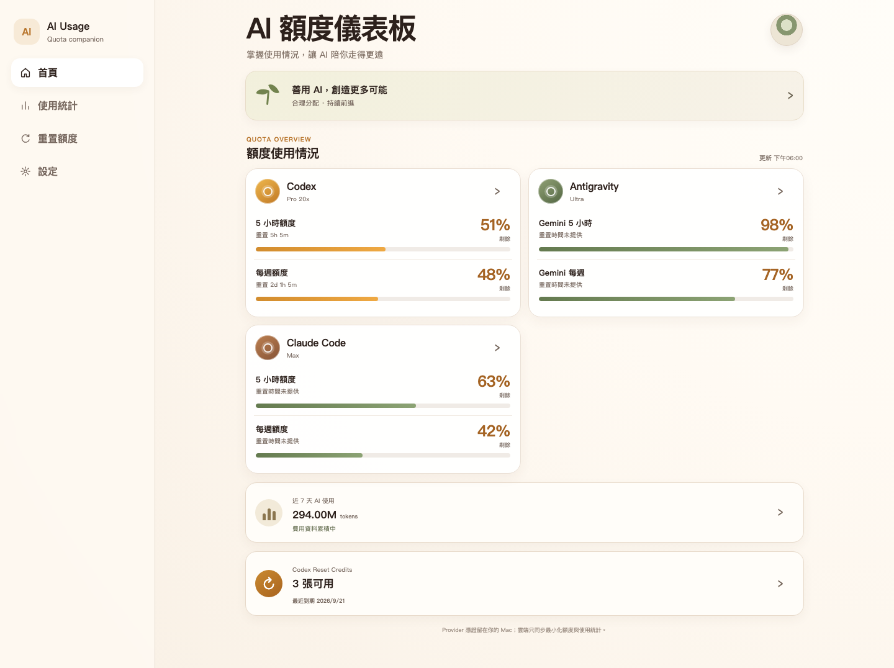
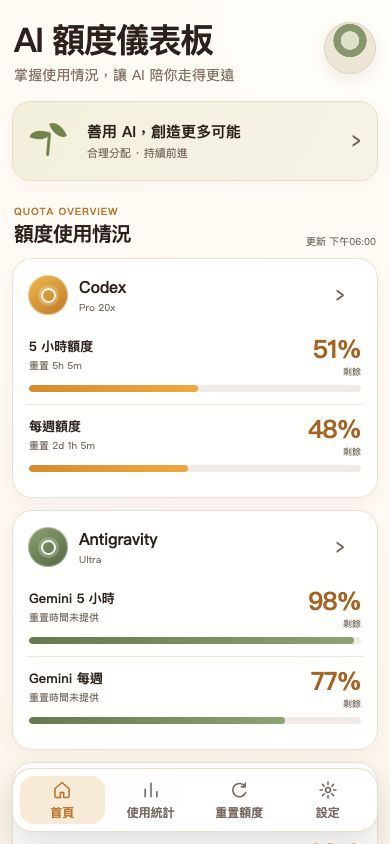
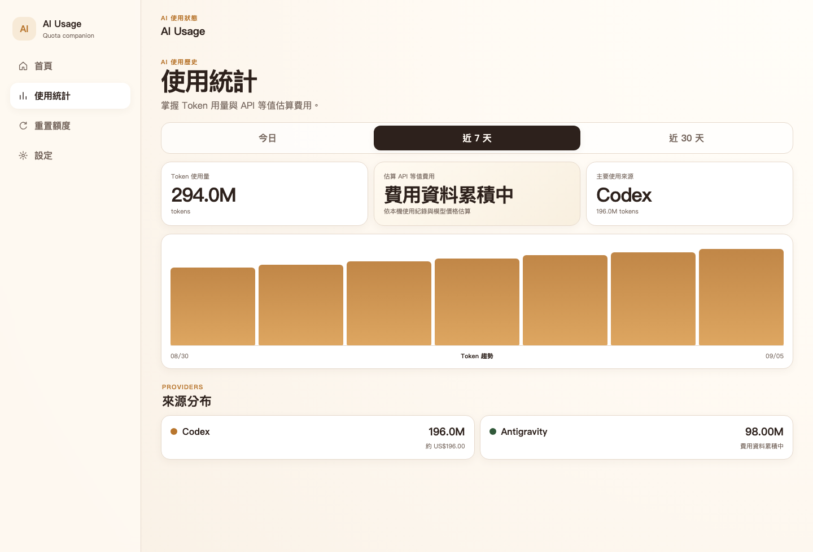
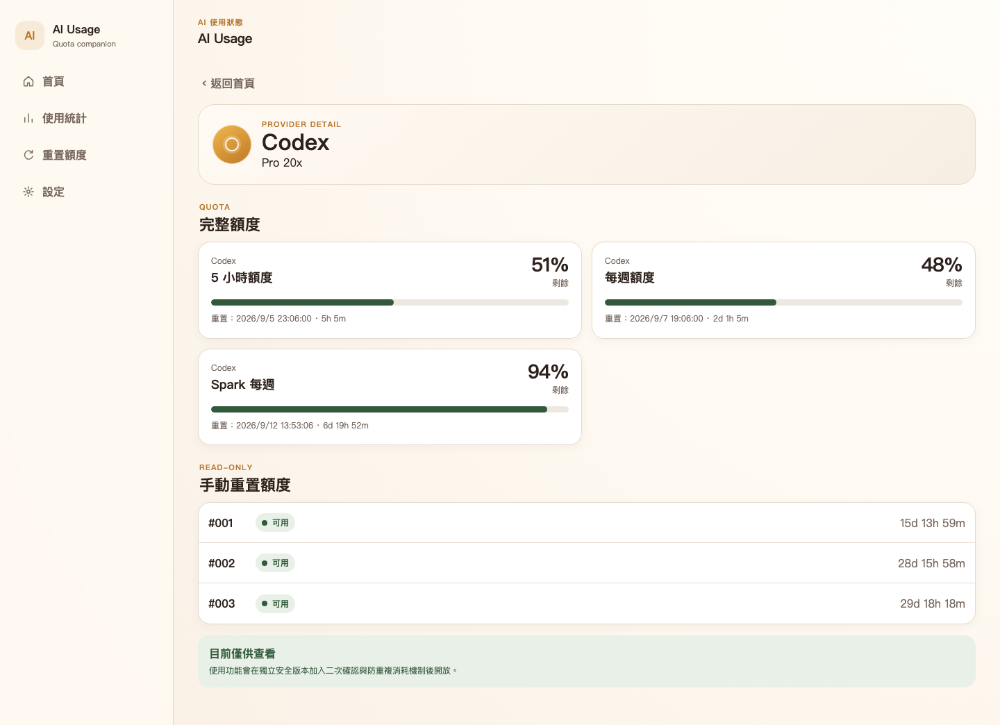

# 94AiUsageDashboard

> **把 Codex、Antigravity、Claude Code 的額度、Token、估算費用與同步狀態，集中在一個乾淨的 AI Usage Dashboard。**

**App-first · Mobile-friendly · Self-hosted-capable · Read-only by design**

[](https://github.com/superafat/94AiUsageDashboard-Public/releases/latest)
[](LICENSE)

<p align="center">
  
</p>

94AiUsageDashboard 讓你快速看懂目前 AI 工具的**剩餘額度、重置時間、近期 Token 使用量、估算 API 等值費用與同步健康狀態**。介面以手機與桌面都好讀為目標，重要資訊先顯示，不需要先理解底層資料結構。

目前公開版本：**v0.1.3**。

## 你可以看到什麼

| 功能 | 用途 |
| --- | --- |
| **多 Provider 額度總覽** | 同一頁查看 Codex、Antigravity、Claude Code 的主要額度 |
| **使用趨勢** | 查看今日、近 7 天、近 30 天 Token 使用量 |
| **費用估算** | 在資料完整時顯示 API 等值估算費用；資料不足時明確標示累積中 |
| **重置時間與 Reset Credits** | 顯示可觀察到的重置時間與可用 Reset Credits，維持只讀 |
| **Freshness / Offline 狀態** | 過期、同步中斷或離線都會清楚標示，不把舊資料假裝成新資料 |
| **PWA** | 可在手機或桌面瀏覽器使用，也可加入主畫面 |

## 手機也能快速看

<p align="center">
  
</p>

首頁用卡片直接呈現最常看的額度與狀態；手機版保留底部導覽，方便在「首頁、使用統計、重置額度、設定」之間切換。

## 使用統計

<p align="center">
  
</p>

- 今日／近 7 天／近 30 天快速切換。
- 顯示 Token 總量、主要使用來源與趨勢。
- 費用只有在資料條件足夠時才計算；**估算費用不是實際帳單**。
- 歷史資料最多保留 35 天的每日彙總。

## Provider 詳細額度

<p align="center">
  
</p>

Provider 詳細頁保留來源真正提供的資訊。缺少數值就省略或標示未知，**不猜值、不造假 0% / 100%**。Reset Credits 目前維持唯讀，不提供消耗按鈕。

## 支援來源

| Provider | 目前可顯示內容 |
| --- | --- |
| **Codex** | Session、Weekly、Spark 類額度、重置時間、Reset Credits、歷史用量 |
| **Antigravity** | Gemini / non-Gemini Session 與 Weekly 額度、歷史用量 |
| **Claude Code** | Session、Weekly，以及來源有提供時的模型／Extra Usage 類資源 |

實際欄位以 OpenUsage 能穩定取得的資料為準；來源沒有提供的數值，Dashboard 不會自行推測。

## 它怎麼運作

```text
AI CLI / Desktop App
        ↓
     OpenUsage
        ↓ local only
 Local Agent on macOS
        ↓ usage snapshot
  Your own Firebase
        ↓ Google Authentication
      Web / PWA
```

資料由 Mac 上的 **OpenUsage** 讀取，Local Agent 正規化後同步到**你自己的 Firebase**。Web / PWA 使用 **Google Authentication** 登入後，只讀取登入者自己的資料。

Provider 憑證留在 Mac。Dashboard **不會上傳 OAuth 權杖、API key、Cookie、Prompt、Response、對話內容或原始程式碼**。

## 快速開始

一般使用者與第一次安裝建議先看 [`docs/getting-started.md`](docs/getting-started.md)。如果要讓 AI 程式碼助理協助安裝，請讓它遵循 [`AI_INSTALL.md`](AI_INSTALL.md)。

### 安裝需求

- macOS 15 或更新版本（目前 Local Agent）
- Node.js 22 LTS
- Firebase CLI
- OpenUsage
- Java 21+（只有 Firebase Emulator 測試需要）

### 下載

```bash
git clone https://github.com/superafat/94AiUsageDashboard-Public.git
cd 94AiUsageDashboard-Public
npm ci
cp .env.example .env.local
```

在 `.env.local` 填入你自己的 Firebase Web 公開設定；不要放 refresh token、service-account JSON 或其他秘密。

### Firebase

1. 建立 Firebase 專案與 Web App。
2. 啟用 **Google Authentication**。
3. 建立 Cloud Firestore。
4. 設定自己的 Firebase Web config。
5. 先驗證，再部署 **Firestore Security Rules**。

```bash
npm run test:rules
firebase use YOUR_FIREBASE_PROJECT_ID
firebase deploy --only firestore
```

### Local Agent

```bash
npm run usage -- doctor
npm run usage -- doctor --json
npm run usage -- setup
```

`setup` 是**可重跑**流程，而且**不會自動安裝 OpenUsage**。Local Agent 會優先讀取 **OpenUsage CLI**；只有 CLI 不可用時，才使用限定在 localhost 的 **HTTP fallback**。完成後可安裝背景同步，正常情況每 5 分鐘更新一次。想立即更新可執行：

```bash
npm run usage -- sync
```

### Web / PWA

```bash
npm run build -w apps/web
npm run preview -w apps/web
```

自行部署 Hosting：

```bash
firebase deploy --only hosting
```

## 資料正確性

94AiUsageDashboard 對「看起來正常但其實是舊資料」採保守策略：

- 來源明確回報 stale → 顯示可能過期。
- 背景同步超時 → 顯示可能過期。
- 來源資料太舊 → 顯示可能過期。
- 重新上傳舊資料 → 不會把時間洗成新資料。
- 單一 Provider 失敗 → 不阻止其他 Provider 完成同步。
- 缺少欄位 → 不補假值。

## 隱私與安全

同步內容限制在額度快照、每日 Token／估算費用彙總與最小化裝置健康狀態。

**不會同步或上傳：**

- OAuth access / refresh token
- API key / Cookie
- Prompt / Response
- AI 對話內容
- Codex / Claude session 原文
- 原始程式碼或 repo 內容
- 本機完整路徑

Local Agent 的長期登入憑證保存在 macOS Keychain。Firestore Security Rules 會拒絕未登入存取與跨 UID 讀寫。

完整安全說明請看 [`SECURITY.md`](SECURITY.md) 與 [`docs/privacy-model.md`](docs/privacy-model.md)。

## 產品邊界

這是一個**只讀 AI 使用量與額度觀察工具**。

- 不啟動 AI 工具。
- 不控制 Mac。
- 不遠端購買或重置額度。
- 不集中保存 Provider 憑證。
- 不把 estimated cost 當成實際帳單。
- 工作派工與模型調度不屬於本產品；若搭配其他系統，應由獨立的 **DevControl** 負責。

## App-first 路線

目前 Web / PWA 已可使用。後續方向是讓同一套 UI 與 domain logic 延伸成 Android / iPhone App，而不是維護兩套獨立產品。

未來一般使用者的目標流程是從 **Google Play / App Store** 安裝 App，再配對自己的 Mac。原生外殼預設採 **Capacitor**；`BackendProfile` 用來隔離目前 Self-hosted 後端與未來 official-app 後端，避免把兩種模式的設定混在一起。

> Android / iPhone 商店版目前**尚未發布**。**Self-hosted 是進階使用方式**，也是現在可實際使用的公開部署方式。

## 驗證

專案提供完整的本機與公開發布驗證：

```bash
npm run lint
npm run typecheck
npm test
npm run test:rules
npm run test:acceptance
npm run build
npm run test:e2e
npm run verify:public-release
```

公開發布會經過 Secret scan、Git 歷史稽核、乾淨匯出、Firestore Rules、acceptance、Browser E2E 與 production dependency audit。

## 文件

- [Getting Started](docs/getting-started.md)
- [AI-assisted Install](AI_INSTALL.md)
- [macOS Install](docs/install-macos.md)
- [Privacy Model](docs/privacy-model.md)
- [Troubleshooting](docs/troubleshooting.md)
- [Uninstall](docs/uninstall.md)
- [Security](SECURITY.md)

## 開源

公開倉庫：[`superafat/94AiUsageDashboard-Public`](https://github.com/superafat/94AiUsageDashboard-Public)

94AiUsageDashboard 採用 **MIT License**。第三方授權資訊請見 [`THIRD_PARTY_NOTICES.md`](THIRD_PARTY_NOTICES.md)，貢獻方式請見 [`CONTRIBUTING.md`](CONTRIBUTING.md)。
